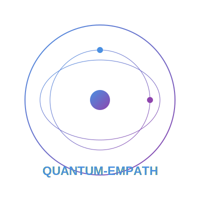

# QUANTUM-EMPATH (Quantum Emotional Metrics & Pattern Analysis Through Harmonic-balance)

<div align="center">
  
</div>

## Overview

QUANTUM-EMPATH is a sophisticated quantum computing framework for analyzing emotional transitions through the lens of quantum mechanics. It provides detailed insights into the quantum characteristics of emotional states and their transitions, utilizing advanced coherence-entropy analysis and quantum signature detection.

## Key Features

### Quantum State Analysis
- Advanced coherence metrics using L1-norm calculation
- Regularized von Neumann entropy computation
- Quantum interference pattern detection
- Entanglement analysis for emotional states

### Balance Point Analysis
- Multi-criteria critical point detection
- Adaptive threshold computation
- Local window analysis for transition detection
- Stability metric calculation

### Visualization Suite
- Phase space trajectory mapping
- Coherence-entropy evolution plots
- Stability band visualization
- Critical point annotation
- Interactive transition pattern analysis

## Technical Components

### Core Analyzers

#### EnhancedCoherenceEntropyAnalyzer
- Normalized coherence calculation
- Regularized entropy computation
- Enhanced balance measure with stability bands
- Phase space trajectory analysis
- Critical point detection with local window analysis

#### QuantumSignatureAnalyzer
- Interference pattern detection
- Entanglement measurement
- Phase relationship analysis
- Quantum correlation tracking

### Key Metrics

#### Coherence Metrics
- L1-norm coherence with normalization
- Off-diagonal element analysis
- Density matrix decomposition

#### Entropy Calculation
- Von Neumann entropy with regularization
- Eigenvalue spectrum analysis
- Normalized entropy scaling

#### Balance Measures
- Coherence-entropy balance computation
- Stability band calculation
- Transition pattern detection

## Implementation Details

### Dependencies
- Qiskit (>=0.34.0)
- NumPy
- Matplotlib
- SciPy

### Core Functions

```python
def analyze_transition(state_history: List[Statevector]) -> Dict[str, Any]:
    """
    Analyzes quantum emotional transition with enhanced metrics.
    
    Args:
        state_history: List of quantum states during transition
        
    Returns:
        Dictionary containing detailed analysis results
    """
```

### Key Methods

```python
def _calculate_coherence(self, state: Statevector) -> float:
    """Calculates enhanced L1-norm coherence with regularization."""

def _calculate_entropy(self, state: Statevector) -> float:
    """Calculates regularized von Neumann entropy."""

def _calculate_balance(self, coherence: float, entropy: float) -> float:
    """Calculates enhanced balance measure with normalization."""
```

## Usage Examples

### Basic Analysis
```python
# Initialize quantum emotion processor
qep = QuantumEmotionProcessor()

# Define emotional states
initial_state = (0.8, 0.6, 0.4)  # Happiness
target_state = (-0.7, 0.2, -0.5)  # Sadness

# Perform analysis
analyzer = EnhancedCoherenceEntropyAnalyzer()
results = analyzer.analyze_transition(state_history)
```

### Visualization
```python
# Visualize analysis results
analyzer.visualize_analysis(results)
```

## Output Metrics

The system provides comprehensive analysis results including:
- Coherence evolution over transition steps
- Entropy changes and patterns
- Balance measure with stability bands
- Critical points with detailed characteristics
- Phase space trajectories
- Transition pattern analysis

## Use Cases

1. **Emotional Transition Analysis**
   - Track quantum signatures during emotional changes
   - Identify critical points in transitions
   - Analyze stability of emotional states

2. **Quantum Characteristic Detection**
   - Measure quantum interference patterns
   - Analyze entanglement in emotional states
   - Track phase relationships

3. **Stability Analysis**
   - Monitor emotional state stability
   - Identify transition patterns
   - Analyze balance point characteristics

## Future Development

- Integration with quantum hardware
- Enhanced visualization capabilities
- Additional quantum metrics
- Real-time analysis features
- Extended emotional state mappings

## Technical Requirements

- Python 3.8+
- Qiskit quantum computing framework
- NumPy for numerical computations
- Matplotlib for visualization
- SciPy for advanced mathematical operations

## Contributing

Contributions are welcome! Please read the contribution guidelines and code of conduct before submitting pull requests.

## License

MIT License - see LICENSE.md for details

## Citation

When using QUANTUM-EMPATH in your research, please cite:
```
QUANTUM-EMPATH: A Quantum Computing Framework for Emotional State Analysis
Version 1.0 (2025)
```

## Acknowledgments

- Quantum computing community
- Affective computing researchers
- Open-source contributors

---

*Note: QUANTUM-EMPATH is a research tool and should be used in conjunction with other emotional analysis methods for comprehensive understanding.*
